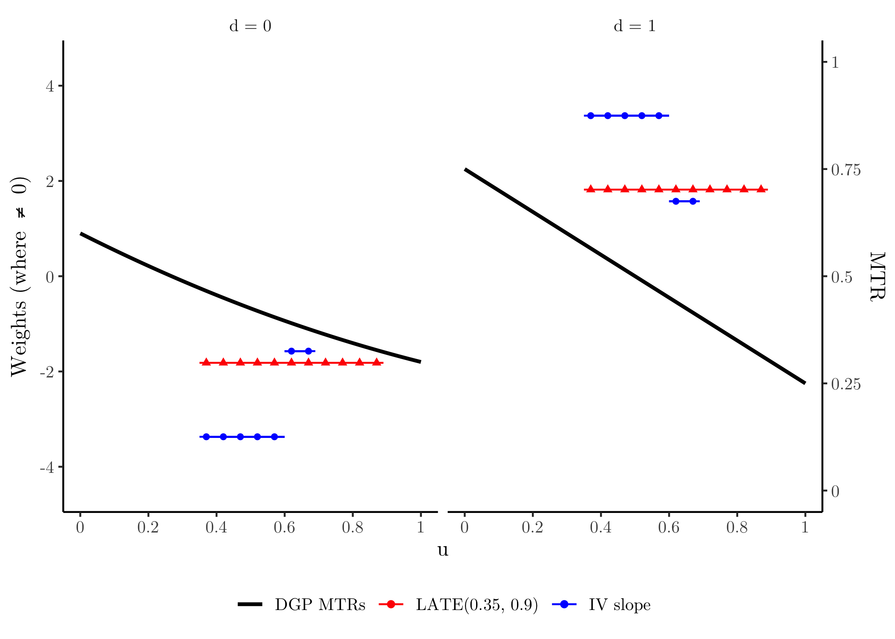
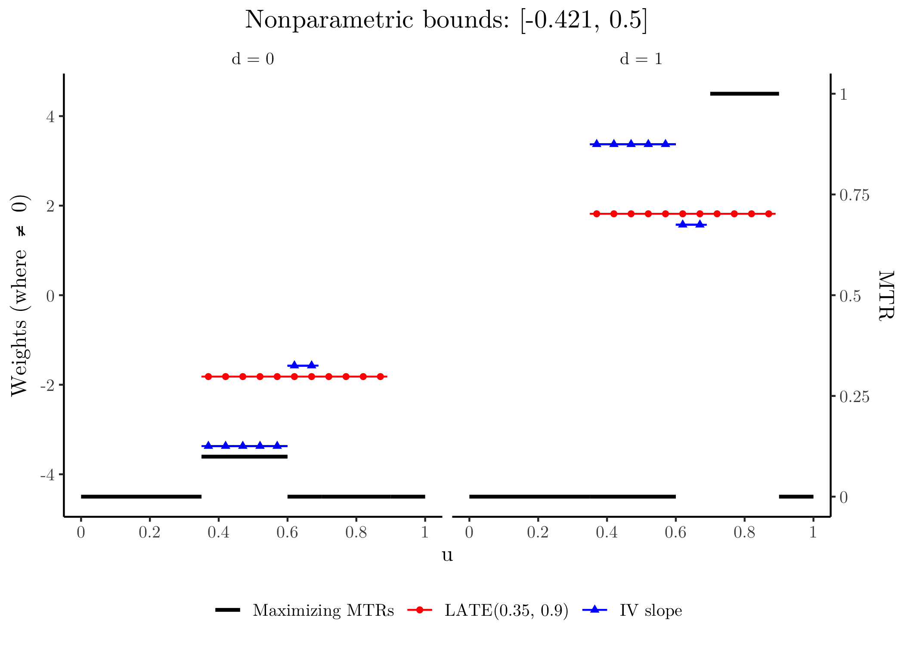
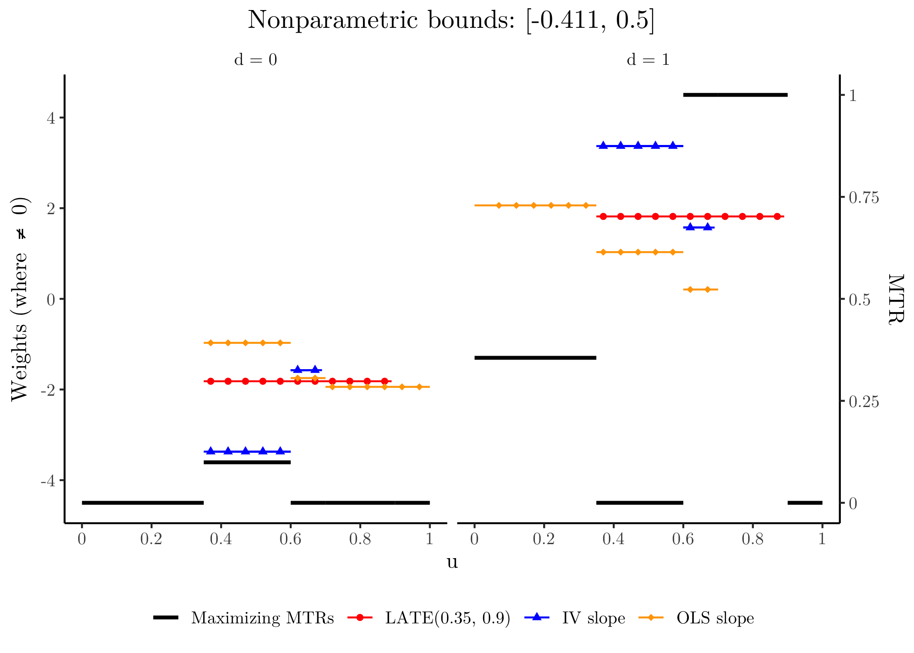
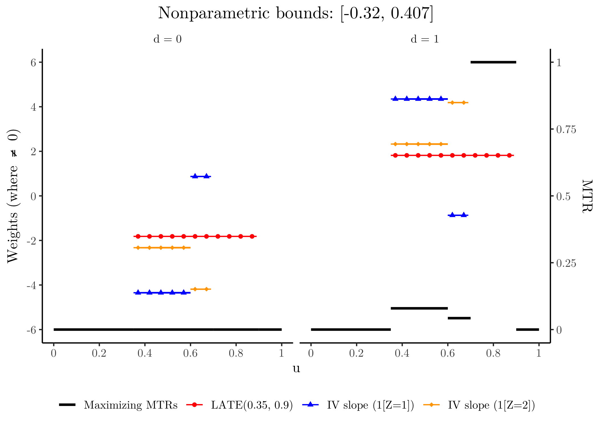
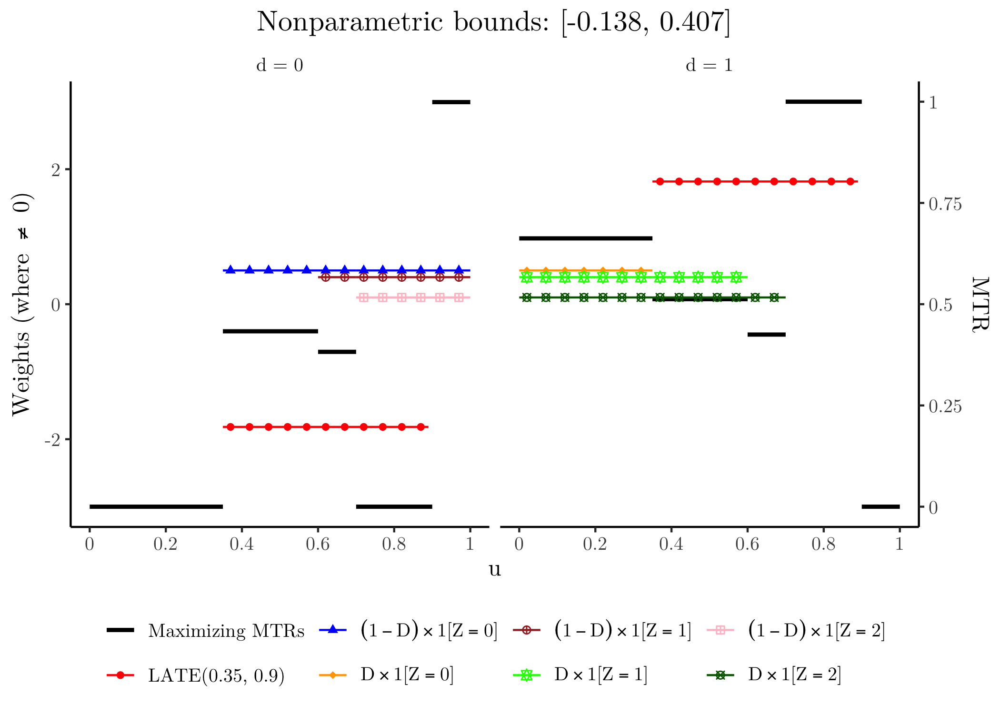
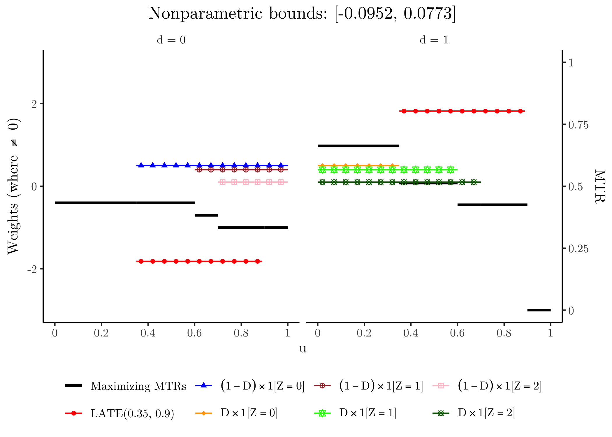
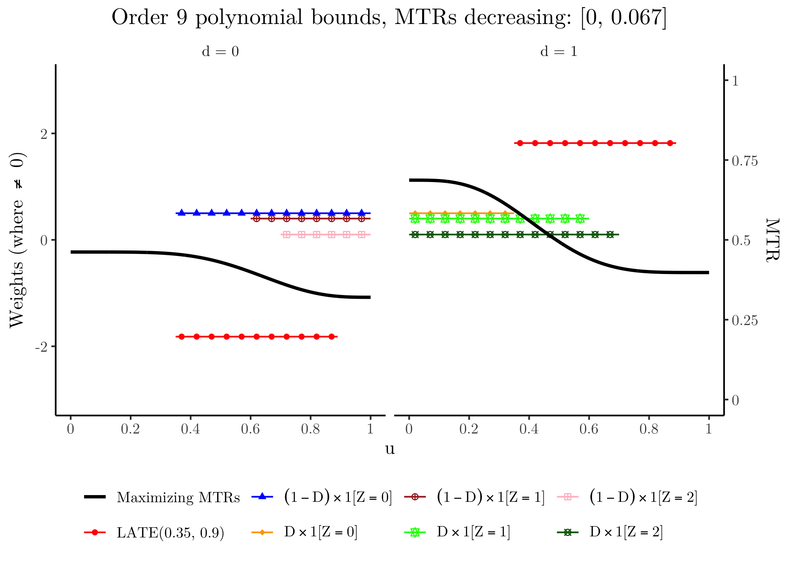
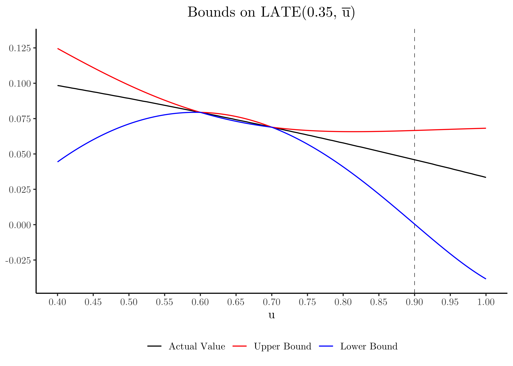

<!-- badges: start -->


<!-- badges: end -->

## Introduction

The `ReplicateMST2018` package…

## Installation

The `ReplicateMST2018` package is hosted on GitHub at
<https://github.com/ian-xu-economics/ReplicateMST2018/>. It can be
installed using the `remotes::install_github()` function:

``` r
# install.packages("remotes")
remotes::install_github("ian-xu-economics/ReplicateMST2018")
```

## Using `ReplicateMST2018`

After installing `ReplicateMST2018`, we can attach the package to our
session using the base `library()` function. We’ll also attach some
other packages needed to run the examples in the vignette.

``` r
library(ReplicateMST2018)
library(tidyverse)
library(glue)
library(latex2exp)
```

## Replicating Figures

In order to produce the figures in Mogstad, Santos, and Torgovitsky
(2018), we first need to define the data generating process (DGP). We’ll
save the DGP used in the paper into `dgp`.

``` r
dgp <- dgp_MST2018()
```

### Figure 1

<!-- -->

### Figure 2

<!-- -->

### Figure 3

<!-- -->

### Figure 4

<!-- -->

### Figure 5

<!-- -->

### Figure 6

<!-- -->

### Figure 7

<!-- -->

### Figure 8

<!-- -->
